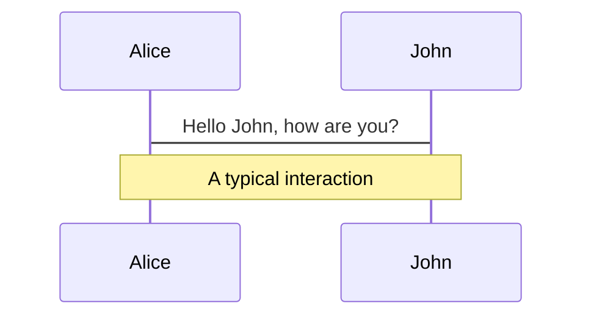
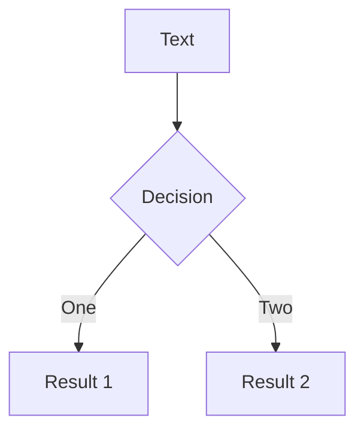
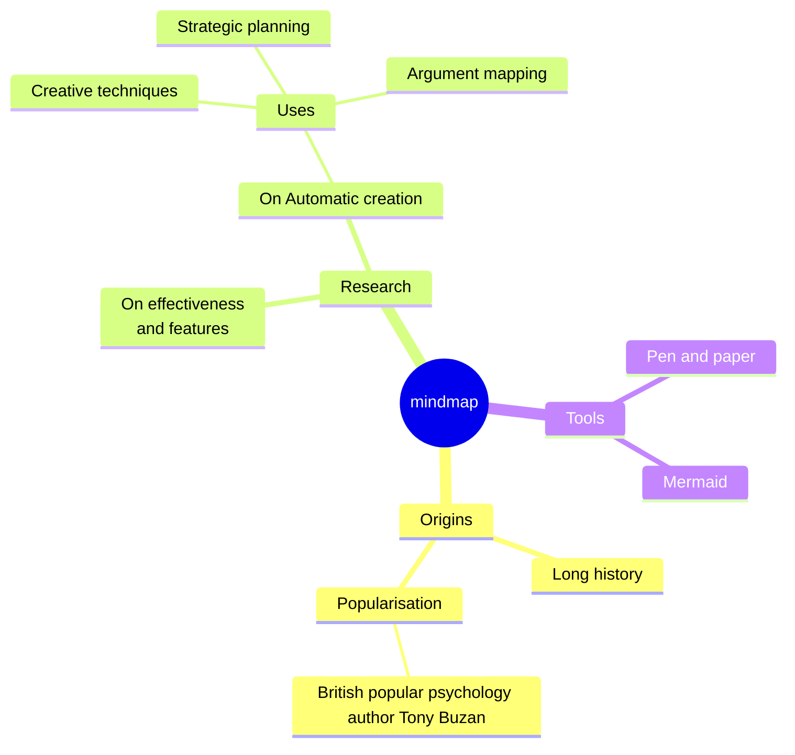
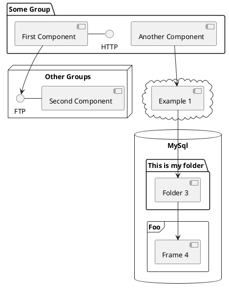

# {{ title }}

**Create, View, and Share Beautiful Product Slides**

<div class="mt-2 text-lg" style="color: #0A192F">Your product, presented in the best light.</div>

<div class="flex w-full justify-center items-center mt-10">
  
</div>

<div class="mt-12 py-1 flex justify-center items-center">
  <button @click="$slidev.nav.next" class="px-6 py-2 rounded-lg font-bold text-white" style="background-color: #F9A826;">
    Next &rarr;
  </button>
</div>

<div class="abs-br m-6 text-xl">
  <button @click="$slidev.nav.openInEditor" title="Open in Editor" class="slidev-icon-btn">
    <carbon:edit />
  </button>
  <a href="https://github.com/slidevjs/slidev" target="_blank" class="slidev-icon-btn">
    <carbon:logo-github />
  </a>
</div>

---

transition: fade-out
layout: center
class: text-center
---

# Why this platform?

<div class="flex justify-center">
  
</div>
<div class="mt-10 flex justify-center">
  <ul style="list-style: none; padding: 0;">
    <li style="color: #0A192F; font-weight: bold;"><span style="color: #F9A826;">&#9679;</span> Modern & Light Theme</li>
    <li style="color: #0A192F; font-weight: bold;"><span style="color: #F9A826;">&#9679;</span> Effortless Slide Navigation</li>
    <li style="color: #0A192F; font-weight: bold;"><span style="color: #F9A826;">&#9679;</span> Responsive on Any Device</li>
    <li style="color: #0A192F; font-weight: bold;"><span style="color: #F9A826;">&#9679;</span> Eye-catching Product Media</li>
    <li style="color: #0A192F; font-weight: bold;"><span style="color: #F9A826;">&#9679;</span> Shareable Presentation Links & QR</li>
  </ul>
</div>

---

---
transition: fade-out
---

transition: slide-up
background: white
class: text-center
---

# Effortless Navigation

Navigate your product slides with ease using:

<div class="flex flex-col items-center mt-8 mb-6">
  <span class="text-4xl" style="color: #0A192F;">
    <kbd>←</kbd> <kbd>→</kbd> &nbsp; <kbd>Space</kbd> &nbsp; <kbd>PageUp</kbd> <kbd>PageDown</kbd>
  </span>
  <small class="mt-3 text-md" style="color: #222;">
    Keyboard & touch navigation. Responsive arrows appear on all devices.
  </small>
</div>

<div class="flex justify-center gap-10 mt-7">
  <button @click="$slidev.nav.prev" class="p-3 rounded-lg" style="background:#F9A826;color:#FFF;"><carbon:arrow-left /> Prev</button>
  <button @click="$slidev.nav.next" class="p-3 rounded-lg" style="background:#0A192F;color:#FFF;">Next <carbon:arrow-right /></button>
</div>

---

<!--
You can have `style` tag in markdown to override the style for the current page.
Learn more: https://sli.dev/features/slide-scope-style
-->

<style>
h1 {
  background-color: #2B90B6;
  background-image: linear-gradient(45deg, #4EC5D4 10%, #146b8c 20%);
  background-size: 100%;
  -webkit-background-clip: text;
  -moz-background-clip: text;
  -webkit-text-fill-color: transparent;
  -moz-text-fill-color: transparent;
}
</style>

<!--
Here is another comment.
-->

---
transition: slide-up
level: 2
---

transition: slide-left
background: "#F7FAFC"
class: text-center
---

# Responsive & Modern

<div class="flex flex-col md:flex-row items-center justify-center mt-8 gap-7">
  
  
</div>

<div class="mt-6 text-lg" style="color:#0A192F;">
  Looks perfect on mobile, tablet, and desktop. Slides adapt to your audience.
</div>

---
layout: two-cols
layoutClass: gap-16
---

transition: slide-right
background: white
class: text-center
---

# Featured Product

<div class="flex flex-col items-center">
  
  <div class="mt-8 text-2xl font-bold" style="color: #0A192F;">Product Name</div>
  <div class="mt-2 text-lg" style="color: #F9A826;">The best choice for modern users</div>
</div>

<div class="flex justify-center gap-8 mt-9">
  <button class="px-7 py-2 bg-[#0A192F] rounded-lg text-white font-semibold">Learn More</button>
  <button class="px-7 py-2 bg-[#F9A826] rounded-lg text-white font-semibold">Buy Now</button>
</div>

---
layout: image-right
image: https://cover.sli.dev
---

transition: slide-left
background: "#FFF"
class: text-center
---

# Share Your Presentation

<div class="flex flex-col items-center justify-center mt-6">
  
  <div class="text-md mb-4" style="color:#0A192F">Scan to view or share:<br/>
    <span style="color: #F9A826; font-weight:600;">https://your-presentation.link</span>
  </div>
  <button class="px-5 py-2 bg-[#0A192F] rounded-lg text-white font-semibold" @click="navigator.clipboard.writeText('https://your-presentation.link')">Copy Link</button>
</div>

---

---
level: 2
---

# Shiki Magic Move

Powered by [shiki-magic-move](https://shiki-magic-move.netlify.app/), Slidev supports animations across multiple code snippets.

Add multiple code blocks and wrap them with <code>````md magic-move</code> (four backticks) to enable the magic move. For example:

````md magic-move {lines: true}
```ts {*|2|*}
// step 1
const author = reactive({
  name: 'John Doe',
  books: [
    'Vue 2 - Advanced Guide',
    'Vue 3 - Basic Guide',
    'Vue 4 - The Mystery'
  ]
})
```

```ts {*|1-2|3-4|3-4,8}
// step 2
export default {
  data() {
    return {
      author: {
        name: 'John Doe',
        books: [
          'Vue 2 - Advanced Guide',
          'Vue 3 - Basic Guide',
          'Vue 4 - The Mystery'
        ]
      }
    }
  }
}
```

```ts
// step 3
export default {
  data: () => ({
    author: {
      name: 'John Doe',
      books: [
        'Vue 2 - Advanced Guide',
        'Vue 3 - Basic Guide',
        'Vue 4 - The Mystery'
      ]
    }
  })
}
```

Non-code blocks are ignored.

```vue
<!-- step 4 -->
<script setup>
const author = {
  name: 'John Doe',
  books: [
    'Vue 2 - Advanced Guide',
    'Vue 3 - Basic Guide',
    'Vue 4 - The Mystery'
  ]
}
</script>
```
````

---

# Components

<div grid="~ cols-2 gap-4">
<div>

You can use Vue components directly inside your slides.

We have provided a few built-in components like `<Tweet/>` and `<Youtube/>` that you can use directly. And adding your custom components is also super easy.

```html
<Counter :count="10" />
```

<!-- ./components/Counter.vue -->
<Counter :count="10" m="t-4" />

Check out [the guides](https://sli.dev/builtin/components.html) for more.

</div>
<div>

```html
<Tweet id="1390115482657726468" />
```

<Tweet id="1390115482657726468" scale="0.65" />

</div>
</div>

<!--
Presenter note with **bold**, *italic*, and ~~striked~~ text.

Also, HTML elements are valid:
<div class="flex w-full">
  <span style="flex-grow: 1;">Left content</span>
  <span>Right content</span>
</div>
-->

---
class: px-20
---

# Themes

Slidev comes with powerful theming support. Themes can provide styles, layouts, components, or even configurations for tools. Switching between themes by just **one edit** in your frontmatter:

<div grid="~ cols-2 gap-2" m="t-2">

```yaml
---
theme: default
---
```

```yaml
---
theme: seriph
---
```


</div>

Read more about [How to use a theme](https://sli.dev/guide/theme-addon#use-theme) and
check out the [Awesome Themes Gallery](https://sli.dev/resources/theme-gallery).

---

# Clicks Animations

You can add `v-click` to elements to add a click animation.

<div v-click>

This shows up when you click the slide:

```html
<div v-click>This shows up when you click the slide.</div>
```

</div>

<br>

<v-click>

The <span v-mark.red="3"><code>v-mark</code> directive</span>
also allows you to add
<span v-mark.circle.orange="4">inline marks</span>
, powered by [Rough Notation](https://roughnotation.com/):

```html
<span v-mark.underline.orange>inline markers</span>
```

</v-click>

<div mt-20 v-click>

[Learn more](https://sli.dev/guide/animations#click-animation)

</div>

---

# Motions

Motion animations are powered by [@vueuse/motion](https://motion.vueuse.org/), triggered by `v-motion` directive.

```html
<div
  v-motion
  :initial="{ x: -80 }"
  :enter="{ x: 0 }"
  :click-3="{ x: 80 }"
  :leave="{ x: 1000 }"
>
  Slidev
</div>
```

<div class="w-60 relative">
  <div class="relative w-40 h-40">
    
    
    
  </div>

  <div
    class="text-5xl absolute top-14 left-40 text-[#2B90B6] -z-1"
    v-motion
    :initial="{ x: -80, opacity: 0}"
    :enter="{ x: 0, opacity: 1, transition: { delay: 2000, duration: 1000 } }">
    Slidev
  </div>
</div>

<!-- vue script setup scripts can be directly used in markdown, and will only affects current page -->
<script setup lang="ts">
const final = {
  x: 0,
  y: 0,
  rotate: 0,
  scale: 1,
  transition: {
    type: 'spring',
    damping: 10,
    stiffness: 20,
    mass: 2
  }
}
</script>

<div
  v-motion
  :initial="{ x:35, y: 30, opacity: 0}"
  :enter="{ y: 0, opacity: 1, transition: { delay: 3500 } }">

[Learn more](https://sli.dev/guide/animations.html#motion)

</div>

---

# LaTeX

LaTeX is supported out-of-box. Powered by [KaTeX](https://katex.org/).

<div h-3 />

Inline $\sqrt{3x-1}+(1+x)^2$

Block
$$ {1|3|all}
\begin{aligned}
\nabla \cdot \vec{E} &= \frac{\rho}{\varepsilon_0} \\
\nabla \cdot \vec{B} &= 0 \\
\nabla \times \vec{E} &= -\frac{\partial\vec{B}}{\partial t} \\
\nabla \times \vec{B} &= \mu_0\vec{J} + \mu_0\varepsilon_0\frac{\partial\vec{E}}{\partial t}
\end{aligned}
$$

[Learn more](https://sli.dev/features/latex)

---

# Diagrams

You can create diagrams / graphs from textual descriptions, directly in your Markdown.

<div class="grid grid-cols-4 gap-5 pt-4 -mb-6">









</div>

Learn more: [Mermaid Diagrams](https://sli.dev/features/mermaid) and [PlantUML Diagrams](https://sli.dev/features/plantuml)

---
foo: bar
dragPos:
  square: 691,32,167,_,-16
---

# Draggable Elements

Double-click on the draggable elements to edit their positions.

<br>

###### Directive Usage

```md

```

<br>

###### Component Usage

```md
<v-drag text-3xl>
  <div class="i-carbon:arrow-up" />
  Use the `v-drag` component to have a draggable container!
</v-drag>
```

<v-drag pos="663,206,261,_,-15">
  <div text-center text-3xl border border-main rounded>
    Double-click me!
  </div>
</v-drag>


###### Draggable Arrow

```md
<v-drag-arrow two-way />
```

<v-drag-arrow pos="67,452,253,46" two-way op70 />

---
src: ./pages/imported-slides.md
hide: false
---

---

transition: fade-in
background: "#F9A826"
class: text-center
---

# Thank You!

<div class="mt-6 mb-6 text-3xl font-bold" style="color:#0A192F;">Ready to showcase your product?</div>
<div class="mb-9 text-lg" style="color: #FFF">Start now. Make your story memorable.</div>

<div class="flex justify-center gap-8">
  <a href="mailto:contact@yourproduct.com" class="px-7 py-2 bg-[#0A192F] rounded-lg text-white font-semibold">Contact Us</a>
  <a href="https://your-presentation.link" class="px-7 py-2 bg-[#FFF] border border-[#0A192F] rounded-lg text-[#0A192F] font-semibold">Back to Home</a>
</div>

---
